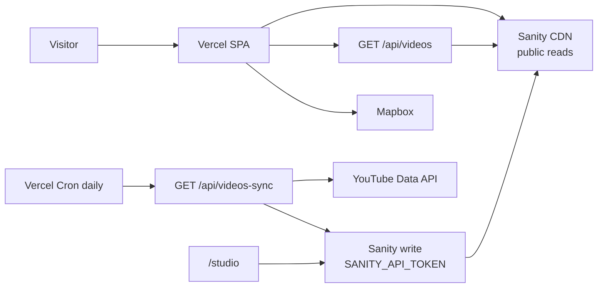

# Drew Della

A Google-parody artist site for **Drew Della**. It looks like a search results page because that’s the joke — and the navigation. Content is real: music, lyrics, photos, videos, blog, socials, and live-show pins.

Live: [drewdella.com](https://drewdella.com)

---

## The idea

Most artist sites are a logo, a player, and a link tree. This one is a **fake SERP** (search engine results page):

- `/` is **All** — the homepage is “results for Drew Della”
- Tabs (All, Music, Images, Videos, Blog, Socials, Lyrics, Shopping, Maps) work like Google’s result-type tabs
- Listings use classic Google grammar: **blue title → green cite → gray snippet**
- Ads exist in-universe (shop, latest album) and are marked sponsored
- Shop with nothing for sale is a Google *“did not match any documents”* empty state, not a 404
- `/home` is the old logo-and-search landing, kept as the “official site” result

The parody has to be **accurate enough to feel like Google**, then break character on purpose (XP congratulations popup, doodles, Helvetica, actual art).

---

## Strategies (what to copy)

These are the product rules, not just implementation details.

### 1. One composition, not a dashboard

The first viewport is a search page: brand, search, tabs, results. No stat strips, no card grid in the hero, no competing modules. Each route has **one job**.

### 2. Brand is the Google logo gag

“Drew Della” is colored like the Google wordmark. If you stripped the nav, you’d still know whose site it is. Headlines never outrank the brand.

### 3. CMS is the source of truth — don’t hardcode the catalog

Albums, lyrics, posts, venues, socials, and photos live in **Sanity**. The site queries them. Don’t bake album names or dates into React. If it should change without a deploy, it belongs in Studio (`/studio`).

### 4. Public read, private write

The `production` dataset is **public**. The browser Sanity client has **no token**. Anything named `VITE_*` is compiled into JS that visitors can download — never put a Sanity write token there.

Writes happen only on the **server** (the daily YouTube snapshot) with `SANITY_API_TOKEN`.

### 5. Snapshot expensive APIs; don’t hit them per visitor

YouTube Data API search costs **100 quota units** per call. Default daily quota is 10,000. A busy launch would burn that in minutes if every page load searched YouTube.

**Pattern:** once a day, a Vercel Cron asks YouTube. If the video IDs changed, it writes a snapshot to Sanity. Visitors always read the snapshot.

That’s not “caching a response for 6 hours.” That’s a **stored list** that survives cold starts and quota death.

### 6. Parody the empty states, not the errors

No fake “Gooooogle” pagination. No fake 404 merch grid. If there’s nothing to sell, say so in Google’s empty-results voice.

### 7. Search is site-wide, ranked, and mobile-first

The header search indexes pages + Sanity docs + stored videos. Typing ranks title matches over body matches. On mobile, the **first tap opens the list without summoning the keyboard**; the second tap allows typing (`readOnly` / `inputMode="none"` until then).

### 8. Stay on the Vercel Hobby plan on purpose

- One cron, **once per day** (`0 14 * * *` UTC)
- Static SPA + a couple of serverless functions
- Sanity CDN for reads (`useCdn: true`)

---

## Architecture



| Piece | Role |
|---|---|
| **Vite + React 18 + React Router** | SPA. `vercel.json` rewrites unknown paths to `index.html`. |
| **Sanity** | Headless CMS. Project `qcu6o4bq`, dataset `production`. |
| **Studio at `/studio`** | Same app, lazy-loaded. Login-gated by Sanity, `robots.txt` disallows it. |
| **Vercel** | Host, serverless `/api/*`, one daily cron. |
| **YouTube** | Channel videos. Fetched only by cron (or first seed if the snapshot is empty). |
| **Mapbox** | Geocode venues + render the map. Public `pk.` token, URL-restrict it. |

Node **20.x**. Build output: `dist`.

---

## Routes

| Path | What it is |
|---|---|
| `/` | All — mixed SERP (homepage) |
| `/all` | Redirects to `/` |
| `/home` | Logo landing + search |
| `/music` | Releases from Sanity |
| `/images` | Gallery + detail panel |
| `/videos` | YouTube list from the snapshot |
| `/blog`, `/blog/:slug` | Posts |
| `/lyrics`, `/lyrics/:slug` | Songs |
| `/connect` | Socials |
| `/shop` | Empty-store parody |
| `/maps` | Live-show venues |
| `/studio/*` | Embedded Sanity Studio |

Tabs are in `src/components/NavTabs/NavTabs.jsx`. Layout (header + tabs + footer) wraps everything except `/home` and `/studio`.

---

## Content model (Sanity)

Schemas live in `studio/schemaTypes/`. Edit content at [drewdella.com/studio](https://drewdella.com/studio) after logging in.

| Type | Studio title | Purpose |
|---|---|---|
| `musicRelease` | Music | Title, description, **release date**, streaming URL, order |
| `song` | Lyrics | Title, album name, portable-text lyrics, slug |
| `blogPost` | Blog Posts | Title, date, portable-text content (can include images), slug |
| `imageGallery` | Images | One gallery document; array of images with alt + caption |
| `socialLink` | Social Links | Title, URL, description, order |
| `mapLocation` | Map Locations | Venue name, optional address, optional coordinates |
| `shopLink` | Shopping Link | Optional future store URL (the page is currently a hard-coded empty state) |
| `youtubeCache` | YouTube cache | **Cron-owned.** Read-only in Studio. Do not hand-edit. |

### Dates

- Releases: fill `date` on `musicRelease`. All/Music listings format it like Google (`Month D, YYYY`).
- Lyrics on All inherit a date by matching `song.album` to a `musicRelease.title` (case-insensitive). Keep those strings in sync.
- Blog uses the post’s own datetime.

### Images

Use alt text. The Images tab and the All-page image one-box both read `imageGallery`.

---

## All page composition

`src/pages/AllPage/AllPage.jsx` is the SERP mixer. Order is intentional:

1. Official site result → `/home`
2. **Images for Drew Della** one-box (thumb strip)
3. Sponsored: shop coming soon
4. Sponsored: latest album (from Sanity, not hardcoded)
5. Mixed organic results — round-robin **blog / lyrics / socials** (releases are *not* repeated under the album ad)
6. Latest **video** sits **under the first blog post**
7. Maps listing is inserted just above a Bandcamp result if one exists, otherwise at the top of the mixed block

A Windows XP “CONGRATULATIONS!!!!” popup docks bottom-right, peeks after a few seconds, and is not a result row.

Related-search footer is shared. There is **no** fake numbered pager.

---

## Site search

`src/lib/siteSearch.js` + `src/components/SearchBar/SearchBar.jsx`

**Index (built once per session):** static pages + Sanity (releases, posts, songs, socials, venues, image alts/captions) + stored videos.

**Ranking (simple on purpose):**

- Exact title = 120
- Title prefix = 80
- Title contains = 50
- Body/haystack contains = 18
- Extra per-word bumps

Empty query shows the old suggestion list. Hits show title + source + a snippet around the match.

**UI:** one visual **shell** (pill when closed, connected panel when open) so the dropdown doesn’t fight the input border. Navbar search stays in its column and doesn’t overlap the logo.

**Mobile:** icon in the header expands a full-width shell. First tap = results list, no keyboard. Lyrics/Store are `margin-left: auto` so they sit on the right.

---

## YouTube snapshot + cron

Hobby plan = **one cron, once a day.** That’s a feature here, not a limitation.

```
every day 14:00 UTC
  Vercel → GET /api/videos-sync
    Authorization: Bearer $CRON_SECRET
    → YouTube search (channel, latest 50, drop Shorts whose title/description contain #)
    → keep 12
    → if IDs === stored IDs: do nothing
    → else write document id `youtubeCache` in Sanity

every visitor
  GET /api/videos → read youtubeCache
  (if empty: one YouTube fetch to seed, then persist if the write token exists)
```

**Stored fields (not the video files):**

```js
{ id, title, thumbnail, publishedAt }
```

YouTube still hosts playback. We only store metadata + thumbnail URLs.

| File | Job |
|---|---|
| `vercel.json` | Cron schedule |
| `api/videos-sync.js` | Daily check + write |
| `api/videos.js` | Public read |
| `lib/youtubeVideos.js` | Shared YouTube + Sanity helpers |
| `studio/schemaTypes/youtubeCache.ts` | Studio view of the snapshot |

`/api/videos` also sends `Cache-Control: public, s-maxage=21600, stale-while-revalidate=86400` so Vercel’s edge doesn’t even hit Sanity on every request.

---

## Maps

Venues are Sanity `mapLocation` docs. The map geocodes the venue name (or address) with Mapbox unless coordinates are set. Token: `VITE_MAPBOX_TOKEN` (public `pk.` — restrict HTTP URLs in the Mapbox dashboard to `drewdella.com` / `www.drewdella.com` / localhost).

---

## Studio

Embedded in the Vite app (`src/pages/StudioPage/StudioPage.jsx`) with `basePath: '/studio'` in `studio/sanity.config.ts`.

- Sanity login protects edits
- `public/robots.txt` → `Disallow: /studio`
- CORS already includes `https://drewdella.com` and `https://www.drewdella.com`

Do not deploy a second Studio on `*.sanity.studio` unless you want two entry points. This repo is the studio.

---

## Frontend vs server env

| Variable | Where | Why |
|---|---|---|
| `VITE_MAPBOX_TOKEN` | Browser | Mapbox GL needs it client-side. Restrict by URL. |
| `YOUTUBE_API_KEY` | Server | Never `VITE_`. Only cron / seed. |
| `YOUTUBE_CHANNEL_ID` | Server | Same. |
| `SANITY_API_TOKEN` | Server | Editor token for snapshot writes. **Not** `VITE_`. |
| `CRON_SECRET` | Server | Vercel sends `Authorization: Bearer …` on cron so the sync URL isn’t public. |

The browser Sanity client (`src/lib/sanity.js`) uses project id + public dataset + CDN only.

If a write token was ever in `VITE_SANITY_API_TOKEN` on Vercel, delete that var, redeploy, and **rotate the token** if it had Editor access.

---

## Local development

```bash
npm install
cp .env.example .env.local   # Mapbox is enough for most UI work
npm run dev                  # http://localhost:3000
```

Vite proxies `/api` → `https://drewdella.com`, so local All/Videos search uses **production** video functions unless you run `vercel dev`.

```bash
npm run build
npm run preview
```

---

## Deployment (Vercel)

Push `main`. SPA rewrite is in `vercel.json`. `/api/*` stays serverless (functions win over the HTML rewrite).

After adding the cron, set on **Production**:

1. `SANITY_API_TOKEN` — Sanity → API → token with write on `production`
2. `CRON_SECRET` — random string
3. Confirm `YOUTUBE_*` and `VITE_MAPBOX_TOKEN` are still there
4. Confirm `VITE_SANITY_API_TOKEN` does **not** exist

First `/api/videos` hit after deploy can seed the snapshot if the write token is present; otherwise wait for 14:00 UTC cron.

---

## SEO / social

`index.html` (SPA, so every route shares this):

- description + `og:title` / `og:description` / `og:url`
- `og:image` → `https://drewdella.com/og.jpg` (1200×630, file in `public/og.jpg`)
- `twitter:card` = `summary_large_image`

Canonical host: pick **drewdella.com** or **www** and 301 the other in Vercel → Domains. `og:url` currently assumes apex.

---

## Project map

```
drewdella/
├── api/
│   ├── videos.js              # Public video list (Sanity snapshot)
│   └── videos-sync.js         # Daily cron
├── lib/
│   └── youtubeVideos.js       # YouTube fetch + Sanity snapshot IO
├── public/
│   ├── og.jpg                 # Share image
│   └── robots.txt
├── src/
│   ├── App.jsx                # Routes
│   ├── components/
│   │   ├── Header/            # Logo, search, Lyrics/Store
│   │   ├── SearchBar/         # Shell + dropdown + mobile
│   │   ├── SearchResults/     # SERP title/cite/snippet, ads, videos
│   │   ├── NavTabs/
│   │   └── Map/
│   ├── lib/
│   │   ├── sanity.js          # Public read client + image URLs
│   │   └── siteSearch.js      # Index + rank
│   └── pages/                 # All, Music, Images, Videos, Blog, …
├── studio/
│   ├── sanity.config.ts
│   └── schemaTypes/
├── vercel.json                # Cron + SPA rewrite
└── index.html                 # Meta + og tags
```

---

## Showing this to people

Talk through it in this order:

1. **The gag** — homepage is a Google results page for the artist
2. **The CMS split** — designers/artists edit Studio; the SERP is just a query
3. **The quota move** — daily snapshot instead of YouTube-on-every-hit
4. **The token rule** — `VITE_` ships to the browser; writes stay on the server
5. **The mobile search trick** — list first, keyboard second
6. **Hobby as a constraint that shaped the design** — one cron, one snapshot, CDN reads

That’s the strategy. The files above are where it lives.
