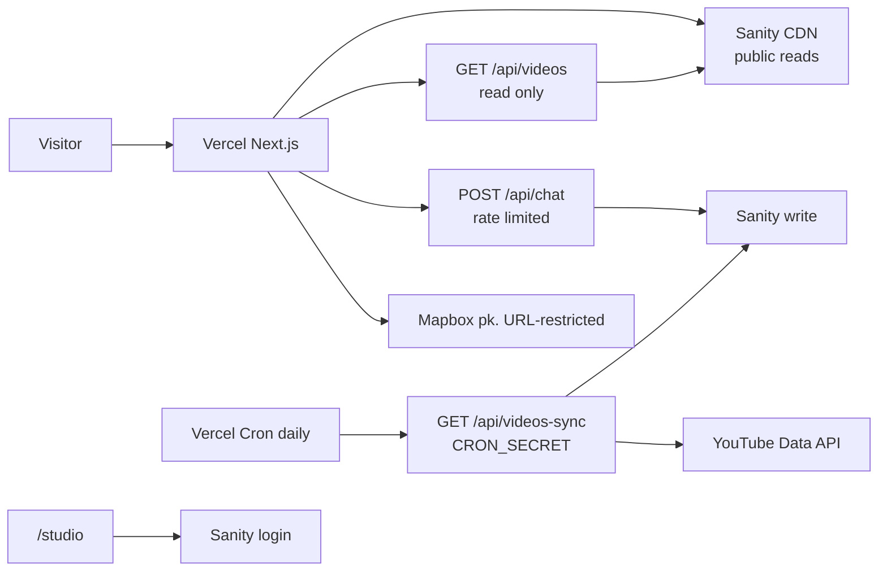

# Drew Della

A Google-parody artist site for **Drew Della**. It looks like a search results page because that’s the joke — and the navigation. Content is real: music, lyrics, photos, videos, blog, socials, live-show pins, and a Hangouts-style chat.

Live: [drewdella.com](https://drewdella.com)

---

## The idea

Most artist sites are a logo, a player, and a link tree. This one is a **fake SERP** (search engine results page):

- `/` is **All** — the homepage is “results for Drew Della”
- Tabs (All, Music, Images, Videos, Blog, Socials, Lyrics, Shopping, Maps) work like Google’s result-type tabs
- Listings use classic Google grammar: **blue title → green cite → gray snippet**
- Ads exist in-universe (shop, latest album) and are marked sponsored
- Shop with nothing for sale is a Google *“did not match any documents”* empty state, not a 404
- `/home` is the old logo-and-search landing, kept as the “official site” result

The parody has to be **accurate enough to feel like Google**, then break character on purpose (XP congratulations popup, Hangouts chat, doodles, Helvetica, actual art).

---

## Strategies (what to copy)

### 1. One composition, not a dashboard

The first viewport is a search page: brand, search, tabs, results. No stat strips, no card grid in the hero. Each route has **one job**.

### 2. Brand is the Google logo gag

“Drew Della” is colored like the Google wordmark. Headlines never outrank the brand.

### 3. CMS is the source of truth

Albums, lyrics, posts, venues, socials, photos, and chat messages live in **Sanity**. If it should change without a deploy, it belongs in Studio (`/studio`).

### 4. Public read, private write

The `production` dataset is **public**. The browser Sanity client has **no token**. Anything named `NEXT_PUBLIC_*` ships to the browser — never put a Sanity write token there.

Server writes use `SANITY_API_TOKEN` only for:

- Hangouts chat posts (`POST /api/chat`)
- Daily YouTube snapshot (`GET /api/videos-sync`)
- Chat rate-limit buckets (hashed, no raw IPs stored)

### 5. Snapshot expensive APIs

YouTube Data API search costs **100 quota units** per call. Visitors never hit YouTube.

**Pattern:** once a day, Vercel Cron calls `/api/videos-sync` (with `CRON_SECRET`). If video IDs changed, it writes `youtubeCache` in Sanity. `GET /api/videos` is **read-only** — Sanity snapshot only.

### 6. Restrict keys at the source (not just rate limits)

| Key | Restriction |
|---|---|
| Mapbox `pk.` | URL allowlist in Mapbox (e.g. `https://drewdella.com`, `http://localhost:3000`) |
| YouTube API key | API restriction → **YouTube Data API v3** only |
| Sanity token | Editor only; revoke old tokens; mark **Sensitive** on Vercel |
| `CRON_SECRET` | Sensitive on Vercel; required in production for sync |

Rate limits (chat) are separate — they slow abuse *after* a request is allowed.

### 7. Parody empty states, not errors

No fake pagination. No fake 404 merch grid. Empty shop = Google empty-results voice.

### 8. Hobby plan on purpose

- One cron, once per day (`0 14 * * *` UTC)
- Next.js App Router + a few serverless routes
- Sanity CDN for public reads

---

## Architecture


```mermaid
flowchart LR
  visitor[Visitor] --> next[Vercel Next.js]
  next --> sanityCDN[Sanity CDN<br/>public reads]
  next --> videosAPI["GET /api/videos<br/>read only"]
  videosAPI --> sanityCDN
  next --> chatAPI["POST /api/chat<br/>rate limited"]
  chatAPI --> sanityWrite[Sanity write]
  cron[Vercel Cron daily] --> sync["GET /api/videos-sync<br/>CRON_SECRET"]
  sync --> youtube[YouTube Data API]
  sync --> sanityWrite
  studio["/studio"] --> sanityAuth[Sanity login]
  next --> mapbox[Mapbox pk. URL-restricted]
```

| Piece | Role |
|---|---|
| **Next.js 15 App Router** | Routes under `app/`, UI under `src/` |
| **Sanity** | CMS. Project `qcu6o4bq`, dataset `production` |
| **Studio at `/studio`** | Embedded Studio, Sanity login, `robots.txt` disallows |
| **Vercel** | Host, serverless `/api/*`, daily cron, SSO on preview URLs |
| **YouTube** | Fetched only by cron |
| **Mapbox** | Geocode + map. Public `pk.` with URL restrictions |

Node **20.x** (`.nvmrc`). Vercel project may run a newer Node; keep engines honest in `package.json`.

---

## Routes

| Path | What it is |
|---|---|
| `/` | All — mixed SERP (homepage) |
| `/all` | Redirects to `/` |
| `/home` | Logo landing + search |
| `/music` | Releases |
| `/images` | Gallery + detail panel |
| `/videos` | YouTube list from snapshot |
| `/blog`, `/blog/[slug]` | Posts |
| `/lyrics`, `/lyrics/[slug]` | Songs |
| `/connect` | Socials |
| `/shop` | Empty-store parody |
| `/maps` | Live-show venues |
| `/studio/[[...tool]]` | Embedded Sanity Studio |
| `/api/videos` | Public snapshot read |
| `/api/videos-sync` | Cron-only refresh |
| `/api/chat` | Hangouts list + post |

---

## Content model (Sanity)

Schemas: `studio/schemaTypes/`. Edit at [drewdella.com/studio](https://drewdella.com/studio).

| Type | Purpose |
|---|---|
| `musicRelease` | Title, description, date, streaming URL, order |
| `song` | Lyrics, album, slug |
| `blogPost` | Post + portable text |
| `imageGallery` | Gallery images |
| `socialLink` | Social URLs |
| `mapLocation` | Venues |
| `shopLink` | Optional store URL |
| `chatMessage` | Hangouts messages |
| `youtubeCache` | Cron-owned snapshot — don’t hand-edit |
| `chatRateBucket` | Server-owned rate buckets — ignore in Studio |

CMS links (`http`/`https` or same-site paths only) are filtered with `safeHref` before render.

---

## Hangouts chat

`src/components/HangoutsChat/` + `app/api/chat` + `lib/chat.js`

- Public `GET` lists recent messages
- `POST` cleans name/body, writes to Sanity
- Rate limits: in-memory (best-effort) + Sanity buckets (per hashed IP/minute + global/minute)
- No CAPTCHA yet — Turnstile is the next hardening step if spam shows up

---

## YouTube snapshot + cron

```
every day 14:00 UTC
  Vercel → GET /api/videos-sync
    Authorization: Bearer $CRON_SECRET
    → YouTube (channel, drop Shorts with #)
    → keep 12 → write youtubeCache if IDs changed

every visitor
  GET /api/videos → read youtubeCache only
  (never calls YouTube, never writes)
```

| File | Job |
|---|---|
| `vercel.json` | Cron schedule |
| `app/api/videos-sync/route.js` | Daily check + write |
| `app/api/videos/route.js` | Public read |
| `lib/youtubeVideos.js` | Shared helpers |

---

## Maps

Sanity `mapLocation` docs. Mapbox geocodes unless coordinates are set.

Token: `NEXT_PUBLIC_MAPBOX_TOKEN` (`pk.`). Restrict URLs in the Mapbox dashboard to your real origins (apex + localhost; add preview hosts if you need maps on `*.vercel.app`).

---

## Env vars

| Variable | Where | Notes |
|---|---|---|
| `NEXT_PUBLIC_MAPBOX_TOKEN` | Browser | URL-restrict in Mapbox |
| `YOUTUBE_API_KEY` | Server | Sensitive. API-restrict to YouTube Data API v3 |
| `YOUTUBE_CHANNEL_ID` | Server | |
| `SANITY_API_TOKEN` | Server | Sensitive. Editor write token |
| `CRON_SECRET` | Server | Sensitive. Required in production for sync |

Copy `.env.example` → `.env.local` for local work. Mapbox alone is enough for most UI.

**Never** put write tokens in `NEXT_PUBLIC_*` (or old `VITE_*`).

---

## Local development

```bash
npm install
cp .env.example .env.local
npm run dev          # http://localhost:3000
npm run build && npm start
```

---

## Deployment

Push `main`. Vercel builds Next.js (`vercel.json` → `"framework": "nextjs"`).

Checklist after secret changes:

1. Env vars marked **Sensitive** where they should be
2. No leftover Development-only old tokens
3. Redeploy so `NEXT_PUBLIC_*` rebuilds into the client
4. Confirm `/api/videos-sync` returns `401` without the bearer secret

Preview / `*.vercel.app` deployment URLs should stay SSO-protected on the team.

---

## Security headers

Set in `next.config.mjs` for all routes:

- `X-Content-Type-Options: nosniff`
- `Referrer-Policy: strict-origin-when-cross-origin`
- `X-Frame-Options: SAMEORIGIN`
- `Permissions-Policy` (camera/mic/geo off)
- `Cross-Origin-Opener-Policy: same-origin-allow-popups`

---

## SEO / social

Metadata in `app/layout.js`:

- `og:image` → `https://drewdella.com/og.jpg`
- Canonical host: **drewdella.com** (apex)

---

## Project map

```
drewdella/
├── app/
│   ├── (serp)/              # SERP routes
│   ├── api/
│   │   ├── chat/
│   │   ├── videos/
│   │   └── videos-sync/
│   ├── home/
│   ├── studio/
│   └── layout.js
├── lib/
│   ├── chat.js              # Chat + shared rate buckets
│   ├── rateLimit.js         # In-memory limiter
│   └── youtubeVideos.js
├── src/
│   ├── components/          # Header, Hangouts, Map, NavTabs, …
│   ├── lib/
│   │   ├── sanity.js
│   │   ├── safeHref.js
│   │   ├── shopLink.js
│   │   └── siteSearch.js
│   └── views/               # Page UIs
├── studio/
│   ├── sanity.config.ts
│   └── schemaTypes/
├── public/
├── next.config.mjs
├── vercel.json
└── .env.example
```
