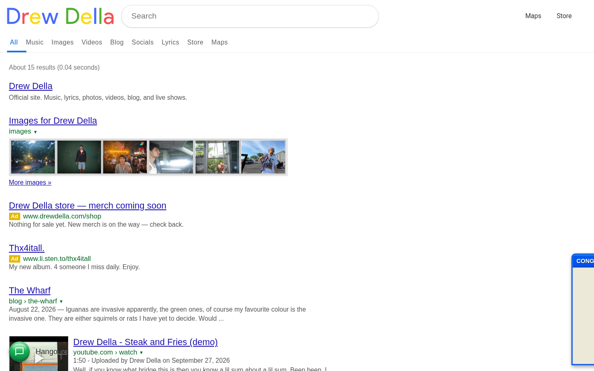

# Drew Della

An artist site for musician Drew Della that is a Google results page on purpose. It looks like a search results page because that is the joke and also how you get around: the tabs work like Google's result-type tabs, and listings use the familiar blue title, green URL and gray snippet.

Live at [drewdella.com](https://drewdella.com).



## What's on it

- `/` is the "All" tab, a mixed results page. `/home` is the old logo-and-search landing page, linked from the main page as the "official site" result.
- Tabs for Music, Images, Videos, Blog, Socials, Lyrics, Shopping and Maps.
- The shop has nothing for sale yet, so it shows a search-engine empty state instead of a 404.
- Site search ranks title matches above body matches across pages, CMS documents and the stored videos.
- A Hangouts-style chat widget that visitors can post to. It is rate limited on the server.
- A map of live-show venues using Mapbox.
- Content (releases, lyrics, blog posts, image gallery, social links, venues) lives in Sanity and is edited from the embedded Studio at `/studio`.

## How the YouTube list works

The Videos tab does not call YouTube on each visit. A daily Vercel cron job (`/api/videos-sync`) checks the channel, drops Shorts, keeps the latest 12 videos and writes them to Sanity if anything changed. `/api/videos` only reads that saved copy. This keeps the quota use to one call a day.

## Stack

Next.js 15 (App Router), React 18, MUI, Sanity, Mapbox GL, Turf, deployed on Vercel.

## Running it locally

You need Node.js 20 or newer (`.nvmrc` pins 22).

```sh
npm install
cp .env.example .env.local
npm run dev
```

Then open http://localhost:3000. The Sanity dataset is public-read, so the site renders without any tokens. Fill in `.env.local` for the parts that need it:

- `NEXT_PUBLIC_MAPBOX_TOKEN`, a public `pk.` token, for the Maps tab
- `YOUTUBE_API_KEY` and `YOUTUBE_CHANNEL_ID` for the video sync
- `SANITY_API_TOKEN`, an editor token used only on the server for chat posts and the video sync
- `CRON_SECRET`, a random string the cron request must send

Only variables starting with `NEXT_PUBLIC_` reach the browser. Never put a Sanity write token in one of those.

## Project layout

- `app/` routes and API handlers (`api/videos`, `api/videos-sync`, `api/chat`)
- `src/views/` one folder per tab
- `src/components/` shared UI, including the chat widget
- `lib/` chat, rate limiting and YouTube helpers
- `studio/` Sanity schemas
